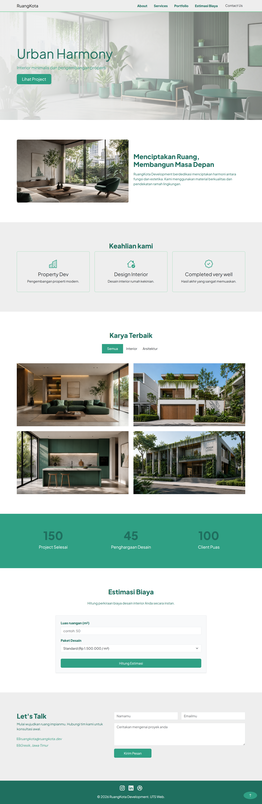

# UTSWeb_Class_4B_0006

Nama: Okta Putra Ramadhan
NIM: 3012410006
Kelas: 4B

Referensi Desain:

* Link: [https://dribbble.com/shots/24417837-Poliform-Interior-Design-Minimalist-Website-Main-Page](https://dribbble.com/shots/24417837-Poliform-Interior-Design-Minimalist-Website-Main-Page)
* Modifikasi: Mengubah warna dasar, menyesuaikan layout dengan grid Bootstrap, dan menambahkan fitur manipulasi DOM.

8 Section:

1. Navbar
2. Hero
3. About
4. Services
5. Portfolio
6. Stats
7. Estimator
8. Contact Us & Footer

Manipulasi DOM:

1. Filter data galeri portfolio (tampil/sembunyi elemen).
2. Counter animation angka berjalan di section stats.
3. Menghitung estimasi biaya layanan secara dinamis.
4. Validasi form input dan menampilkan notifikasi.

## Hasil

